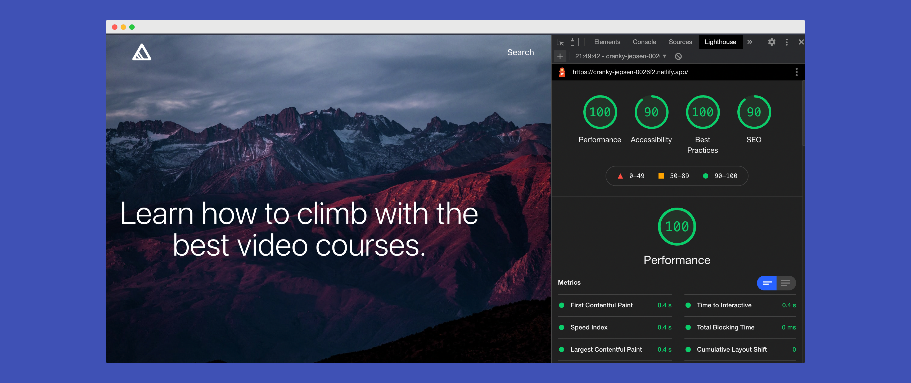

# Boutique⚡️

Boutique⚡️ is a lightweight **JAMstack** e-commerce solution designed to sell your digital products asap. It integrates well with [Flurly](https://flurly.com/) & Gumroad.

You can host this e-commerce for free on [Netlify](https://www.netlify.com/), use the yarn generate command to generate the static files.

You can also use [Forestry.io](https://forestry.io/) as a Headless CMS to manage and edit your products.


Boutique⚡️ is made with **NuxtJS Content** & **TailwindCSS**. It's light 🪶 fast 🚀 resonsive 📱 and use a modern design. It doesn't require a Database, and is perfect to Bootstrap your digital products without having to invest in expensive e-commerce SaaS or server.



## Build Setup

```bash
# install dependencies
$ yarn install

# serve with hot reload at localhost:3000
$ yarn dev

# generate static project
$ yarn generate
```

## How to

### Add a new product

To create new products, create a new .md file in the `content/products` folder. You can use this template below to create new products. NuxtJS Content will then fetch your products and display them on the project. That's it!

```
---
title: <!-- String -->
price: <!-- Number -->
buy: <!-- String - Link to your product -->
type: <!-- String -->
category: <!-- String -->
published: <!-- Boolean -->
description: <!-- String -->
image: <!-- String - Link to your hero image -->
alt: <!-- String -->
socialProof: <!-- Array of Objects. Example
  [
    {
      text: 'Wow. So much climbing.',
      author: '@elonmusk',
      link: 'https://twitter.com/elonmusk/status/1380781539647053826',
    },
  ] -->
video: <!-- String -->
gallery: <!-- Array of Objects. Example
  [
    { src: '/img/gallery1.jpg', alt:'alt text' },
  ] -->
---

Lorem ipsum dolor sit amet, consectetur adipiscing elit, sed do eiusmod tempor incididunt ut labore et dolore magna aliqua. Venenatis a condimentum vitae sapien pellentesque. Vel pharetra vel turpis nunc eget. Sodales neque sodales ut etiam sit amet. Quis hendrerit dolor magna eget est lorem ipsum. Scelerisque eu ultrices vitae auctor eu augue ut. Purus sit amet luctus venenatis lectus. Nisi lacus sed viverra tellus in hac habitasse. Integer eget aliquet nibh praesent tristique. Consequat id porta nibh venenatis cras sed felis eget velit.

## Mattis pellentesque id nibh tortor id aliquet lectus proin.

Dictum non consectetur a erat nam at lectus urna duis. Mus mauris vitae ultricies leo integer malesuada nunc. Semper viverra nam libero justo laoreet sit amet. Nunc sed velit dignissim sodales ut eu. Sit amet massa vitae tortor. In cursus turpis massa tincidunt dui ut ornare. Non odio euismod lacinia at quis risus sed vulputate. Tristique nulla aliquet enim tortor at auctor urna nunc. Tristique senectus et netus et malesuada. Risus nullam eget felis eget nunc lobortis mattis aliquam. Duis at tellus at urna condimentum mattis pellentesque. Nisi quis eleifend quam adipiscing vitae proin sagittis nisl. Enim nec dui nunc mattis enim ut tellus elementum. Ut placerat orci nulla pellentesque dignissim enim. Augue mauris augue neque gravida in fermentum et sollicitudin. Amet aliquam id diam maecenas ultricies mi eget mauris pharetra. Varius quam quisque id diam vel.
```

You can also use Forestry.io as a CMS.

### Change the homepage

You can change the logo in components/NavBar.vue

To change the Homepage elements, open pages/index.vue

Change the Hero image :

```js
data() {
    return {
      image: {
        src:
          'YOUR_IMG_URL.COM',
        alt: 'Image alt',
      },
    }
  },
```

Change the Title of the Homepage :

```html
<!-- SECTION: Title -->
<h1 class="title-home">Learn how to climb with the best video courses.</h1>
<!-- !SECTION: Title -->
```

Change the video of the Homepage :

```html
<!-- SECTION: Video -->
<video class="video-home" playsinline autoplay muted loop id="bgvid">
  <source src="~assets/videos/video.mp4" type="video/mp4" />
</video>
<!-- !SECTION: Video -->
```
